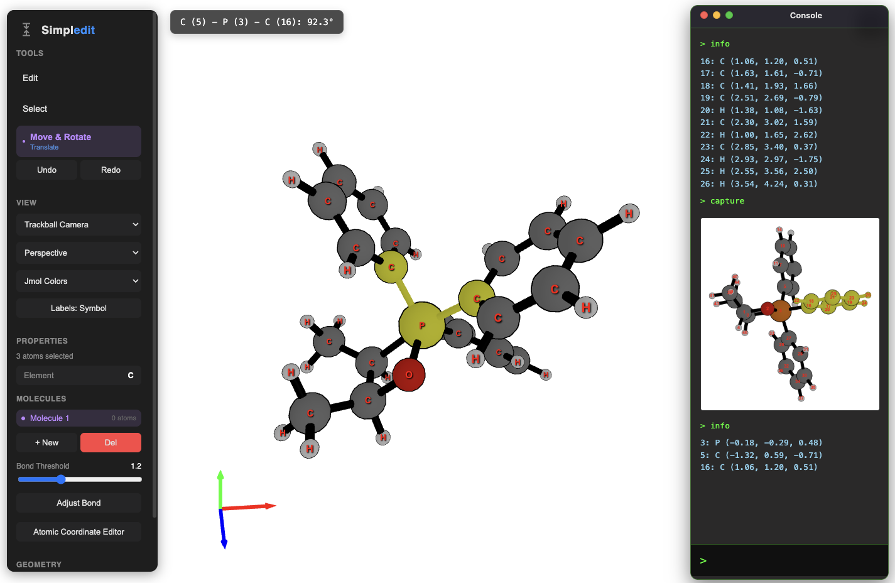

<p align="center">
  
</p>


---

# $${\Large \text{simpl}}{\Large \color{blue}\text{edit}}$$

This project is a simple JavaScript-based molecular editor. It was created because only a few JS-based molecular editors are currently available. The current version is a pre-alpha prototype with a very minimal user interface.

Avogadro2 and the [rowan](https://labs.rowansci.com/editor) are excellent alternatives. However, this project was initiated as a foundation for future work and experimentation.


## Try it Online

**Live Demo**: [https://kangmg.github.io/simpledit/](https://kangmg.github.io/simpledit/)

**Documentation**:
- [Documentation](https://kangmg.github.io/simpledit/tutorial/) 
- [JS API Documentation](https://kangmg.github.io/simpledit/api/)
- [Console CMD Guide](./docs/usage.md)


## Local Development

```bash
# Clone the repository
git clone https://github.com/kangmg/simpledit.git
cd simpledit

# Install dependencies
npm install

# Start development server
npm run dev
# Opens at http://localhost:3000

# Build for production
npm run build

# Generate API documentation
npm run docs
```

## Features

- **Interactive 3D Editor**: Click-and-drag interface for building molecules
- **Selection Tools**: Rectangle and lasso selection modes
- **Advanced Geometry Manipulation**: 
  - Fragment-based geometry engine with rigid body mechanics
  - Real-time bond length, angle, and dihedral adjustments
  - Smart fragment detection for precise molecular control
- **Full Console Integration**: 
  - 30+ commands with aliases for efficient workflows
  - Batch command execution with heredoc support
  - Command history and auto-completion
- **Multi-Molecule Management**: 
  - Unlimited molecules with independent undo/redo history
  - Smart copy/paste/merge with collision avoidance
  - Per-molecule visual settings
- **Intelligent Group Substitution**: 
  - Vector-aligned fragment replacement
  - Automatic dummy atom detection
  - Preservation of molecular geometry
- **Multiple Camera Modes**: Orbit and trackball controls with perspective/orthographic projection
- **Comprehensive Testing**: 19 test suites covering all functionality


## Future Directions

- LLM integration  
- rdkit-js integration for 2D/SMILES sync and broader file format support  
- ASE integration for in-editor calculations with community packages/calculators
- Additional molecule building features
    - enhanced ligand substitution
    - hybridization & steric number aware positioning
    - multi-coordinate driving deformations
