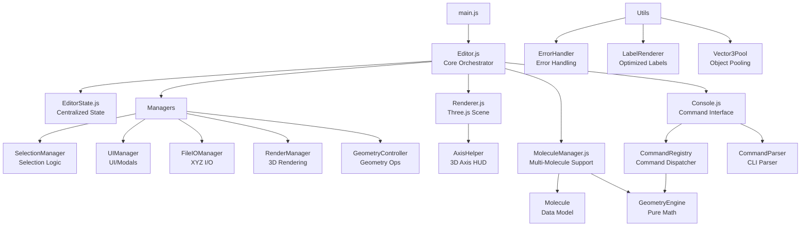

# Simpledit Architecture

## Overview

Simpledit is a web-based molecular editor built with Three.js, featuring a modular architecture with specialized manager classes for different concerns.

## Architecture Diagram



## Core Modules

### Editor.js
**Role:** Central orchestrator  
**Responsibilities:**
- Initialize all managers and subsystems
- Provide high-level API
- Coordinate between modules
- Manage animation loop

**Key Properties:**
- `state`: EditorState instance
- `moleculeManager`: MoleculeManager instance
- `renderer`: Renderer instance
- `console`: Console instance
- Manager instances (selection, ui, fileIO, render, geometry)

### EditorState.js
**Role:** Centralized state management  
**State Categories:**
- **UI State**: labelMode, cameraMode, projection, colorScheme
- **Selection State**: order array, highlighted set
- **Mode**: edit/select/move

**Benefits:**
- Single source of truth
- Validation on state changes
- Supports undo/redo via clone()

## Manager Classes

### SelectionManager
**Purpose:** Atom selection logic  
**Features:**
- Select/deselect atoms
- Range selection, select all, invert
- Selection modes (lasso/rectangle)
- Visual highlights
- Track selection order for geometry ops

### UIManager
**Purpose:** UI interactions and modals  
**Features:**
- Toolbar event bindings
- Modal management (Periodic Table, Coord Editor)
- Label creation and 2D positioning
- PNG export
- Error/success messaging

### FileIOManager
**Purpose:** File import/export  
**Supported Formats:**
- XYZ (import/export)
- JSON coordinate format
- File download handling
- Async file loading

### RenderManager
**Purpose:** 3D mesh management  
**Features:**
- Create atom/bond meshes
- Color schemes (jmol/cpk)
- Scene rebuilding
- Visual updates

### GeometryController
**Purpose:** Geometry manipulation  
**Features:**
- Slider bindings (bond/angle/dihedral) with real-time updates
- Fragment detection for partial manipulation
- Rigid body mechanics for dihedral rotation
- Specialized `getMovingFragmentForDihedral` for proper axis handling
- Uses GeometryEngine for calculations
- Support for continuous UI updates via `oninput` events

## Supporting Modules

### MoleculeManager
**Purpose:** Multi-molecule support  
**Features:**
- Create/delete/switch molecules
- Independent undo/redo per molecule
- Per-molecule visual settings
- Copy/paste/merge between molecules

### Console
**Purpose:** Command-line interface  
**Features:**
- Command parsing (quotes, multiline, heredoc)
- Command history (up/down arrows)
- Command registry with aliases
- Draggable/resizable UI
- Advanced commands: set scale (atom/bond), substitute (atom/group), debug_conn

### Renderer
**Purpose:** Three.js wrapper  
**Features:**
- Scene/camera/controls setup
- Orbit/trackball camera modes
- Perspective/orthographic projection
- Screenshot capture

### GeometryEngine
**Purpose:** Pure geometry calculations  
**Features:**
- Distance/angle/dihedral calculations
- Fragment transformation calculations (bond length, angle, dihedral)
- Vector alignment for molecular fragment substitution
- Shortest-path dihedral rotation with proper direction handling
- All math operations (stateless)

## Utility Classes

### ErrorHandler
**Purpose:** Standardized error handling  
**Response Format:**
```javascript
{ error: "message" }           // Error
{ success: "message", data }   // Success
{ warning: "message" }         // Warning
{ info: "message" }            // Info
```

### LabelRenderer
**Purpose:** Optimized label rendering  
**Optimizations:**
- Dirty checking (only update changed labels)
- RAF batching (max 1 update per frame)
- Separate DOM reads/writes (minimize reflow)

### Vector3Pool
**Purpose:** Object pooling  
**Benefits:**
- Reduce garbage collection
- Reuse THREE.Vector3 instances
- Pre-allocated pool of 100 vectors

## Data Flow

### Atom Addition
```
User Input → Console/UI
    ↓
Editor.addAtom()
    ↓
Molecule.addAtom() (data)
    ↓
RenderManager.createAtomMesh() (visual)
    ↓
UIManager.createAtomLabel() (label)
    ↓
Scene update
```

### Geometry Adjustment
```
User adjusts slider
    ↓
GeometryController.setBondLength()
    ↓
Calculate fragment to move
    ↓
GeometryEngine.getNewPositionsForBondLength()
    ↓
Update atom positions
    ↓
RenderManager.updateAtomVisuals()
    ↓
LabelRenderer.markDirty() → RAF update
```

### Selection
```
User clicks atom
    ↓
Interaction.onClick()
    ↓
SelectionManager.selectAtom()
    ↓
EditorState.addToSelection()
    ↓
Update visual highlight (emissive color)
```

## Design Principles

### 1. Separation of Concerns
- Each manager has a single responsibility
- Data (Molecule) separate from presentation (RenderManager)
- Business logic (GeometryEngine) separate from UI

### 2. State Management
- Centralized state in EditorState
- Validation on all state changes
- Compatibility layer for gradual migration

### 3. Performance
- Dirty checking for minimal updates
- Object pooling for frequent allocations
- RAF batching for DOM operations

### 4. Error Handling
- Consistent error response format
- Development-only logging
- Validation helpers

### 5. Modularity
- Managers can be tested independently
- Clear interfaces between modules
- Easy to add new features

## Future Improvements

### Code Size Reduction
Editor.js is still large (~2000 lines). Further refactoring could:
- Move more methods to managers
- Delegate high-level operations
- Target size: 500-800 lines

### Testing
- Unit tests for GeometryEngine
- Integration tests for command flow
- E2E tests for UI interactions

### Performance
- Use LabelRenderer in production
- Integrate Vector3Pool in GeometryEngine
- Throttle camera movement label updates

## File Structure

```
src/
├── main.js                  # Entry point
├── editor.js                # Core orchestrator
├── editorState.js          # Centralized state
├── renderer.js              # Three.js wrapper
├── moleculeManager.js       # Multi-molecule support
├── console.js               # CLI interface
├── commandParser.js         # Command parsing
├── commandRegistry.js       # Command dispatcher
├── geometryEngine.js        # Pure geometry math
├── axisHelper.js           # 3D axis HUD
├── interaction.js          # Mouse/keyboard handling
├── constants.js            # Element data, UI constants
├── managers/
│   ├── selectionManager.js
│   ├── uiManager.js
│   ├── fileIOManager.js
│   ├── renderManager.js
│   └── geometryController.js
└── utils/
    ├── errorHandler.js
    ├── labelRenderer.js
    └── objectPool.js
```

## Summary

Simpledit uses a **modular, manager-based architecture** with:
- ✅ Centralized state management (EditorState)
- ✅ Specialized managers for different concerns
- ✅ Pure calculation layer (GeometryEngine)
- ✅ Performance optimizations (dirty checking, pooling)
- ✅ Consistent error handling
- ✅ Clear separation of concerns

This architecture supports maintainability, testability, and future enhancements.
